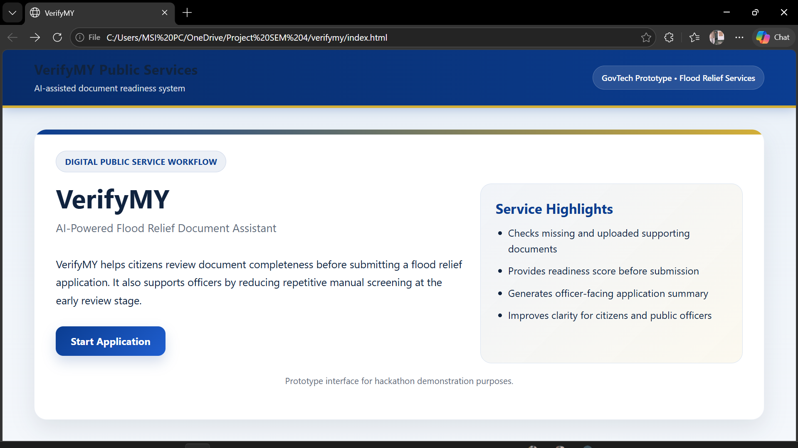
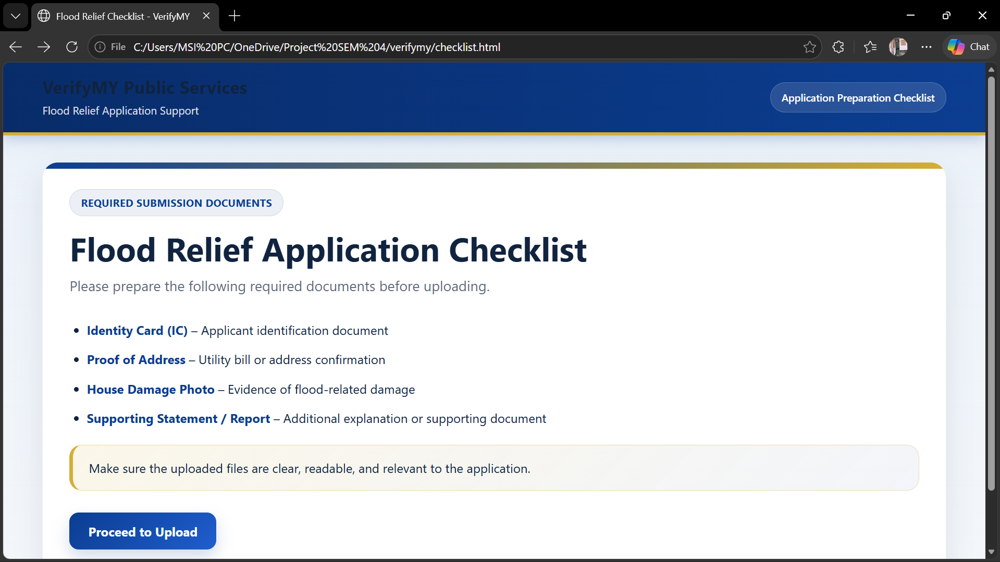
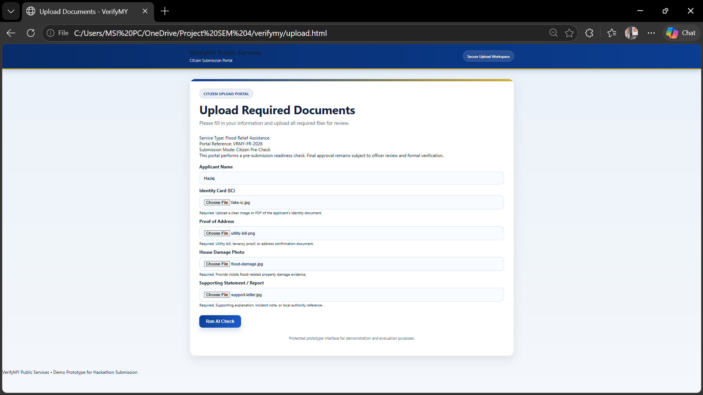
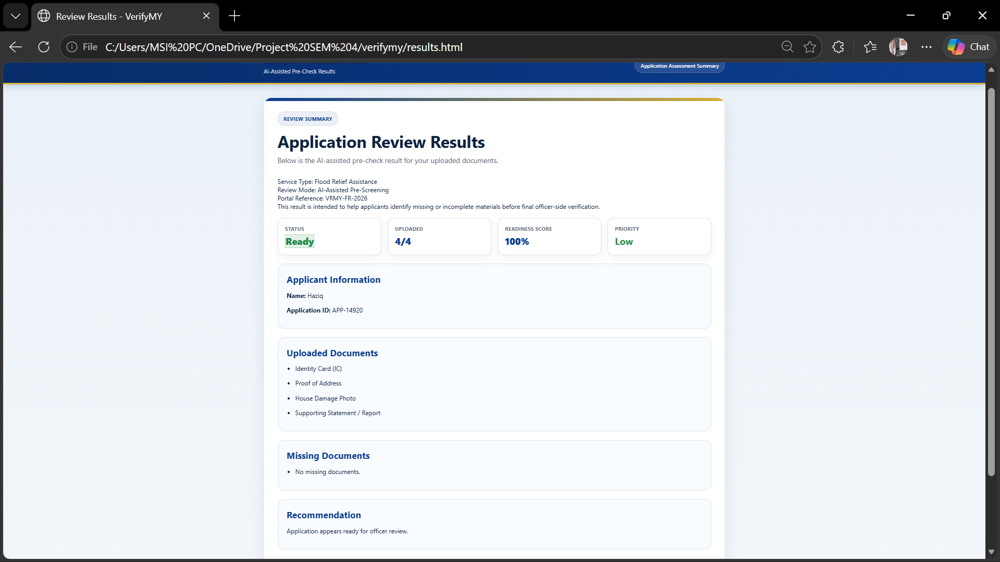
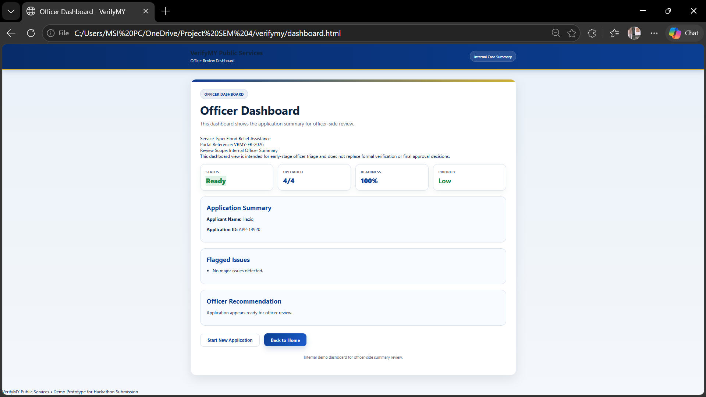

# VerifyMY

## Overview
VerifyMY is a web-based GovTech prototype that helps citizens check whether their flood relief application documents are complete before submission. It also supports officers by summarizing the application status, missing documents, and review readiness.

## Problem Statement
Flood relief applications are often delayed because applicants submit incomplete or unclear supporting documents. This creates extra manual work for officers and slows down early-stage review.

## Solution
VerifyMY provides a citizen-facing upload portal, an AI-assisted pre-check result page, and an officer dashboard. The system calculates document readiness, flags missing files, assigns review priority, and improves application clarity before formal verification.

## Key Features
- Flood relief application checklist
- Citizen document upload portal
- Validation for missing applicant name
- Validation for no uploaded files
- Readiness score calculation
- Priority level assignment
- Missing document detection
- Citizen-facing review results
- Officer-side dashboard summary
- Start new application reset flow

## Tech Stack
- HTML
- CSS
- JavaScript
- localStorage

## Project Pages
- `index.html` – Landing page
- `checklist.html` – Required documents page
- `upload.html` – Citizen upload portal
- `results.html` – AI-assisted review result page
- `dashboard.html` – Officer dashboard

## How the Logic Works
- The applicant enters a name and uploads supporting files.
- The system checks which required files are uploaded.
- A readiness score is calculated based on document completeness.
- Priority is assigned based on the readiness score.
- Missing documents are listed for follow-up.
- The same application data is shown in the officer dashboard.

## Readiness and Priority
- **Readiness** represents document completeness.
- **Priority** represents officer review attention level.

### Example
- 4/4 uploaded = 100% readiness = Low priority
- 3/4 uploaded = 75% readiness = Medium priority
- 2/4 or below = High priority

## Sample Demo Files
The `assets` folder contains sample files for testing:
- `fake-ic.jpg`
- `utility-bill.png`
- `flood-damage.jpg`
- `support-letter.jpg`

## Screenshots

### Home Page

### Checklist Page

### Upload Page

### Results Page

### Officer Dashboard

## How to Run Locally
1. Download or clone the project folder.
2. Open the project in Visual Studio Code.
3. Open `index.html` in a browser.
4. Follow the full workflow from the landing page to the results page and officer dashboard.

## Prototype Note
This project is a prototype built for hackathon demonstration purposes. It focuses on pre-submission document readiness and does not replace formal officer-side verification or final approval.