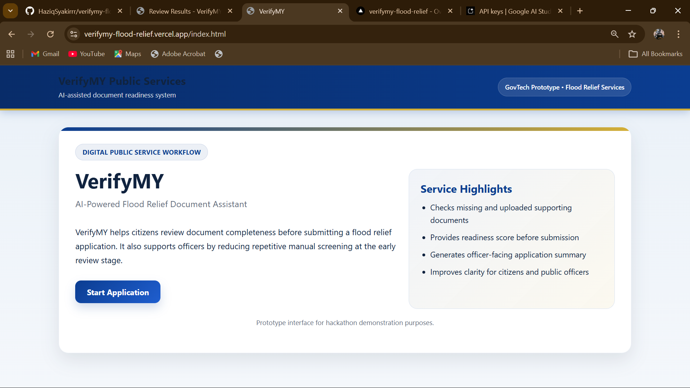
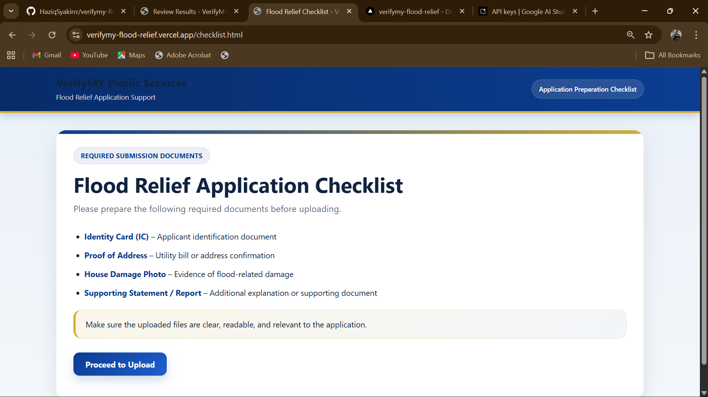
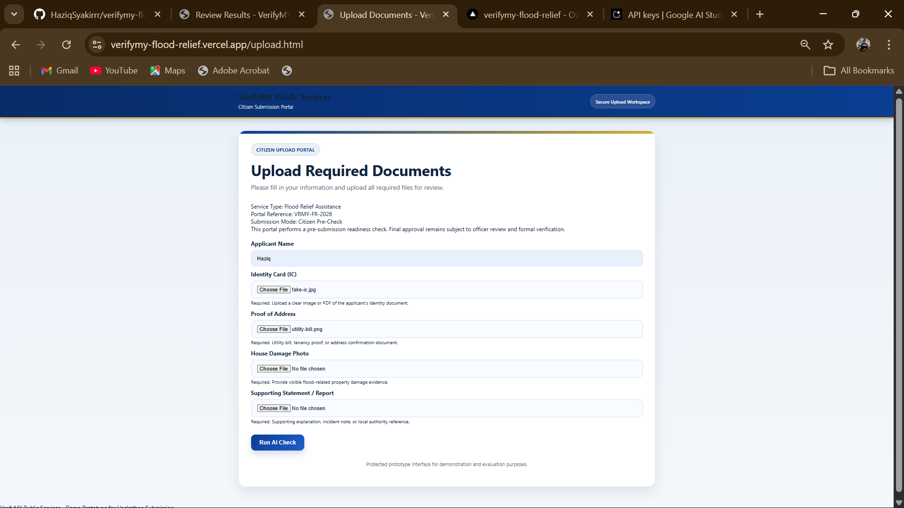
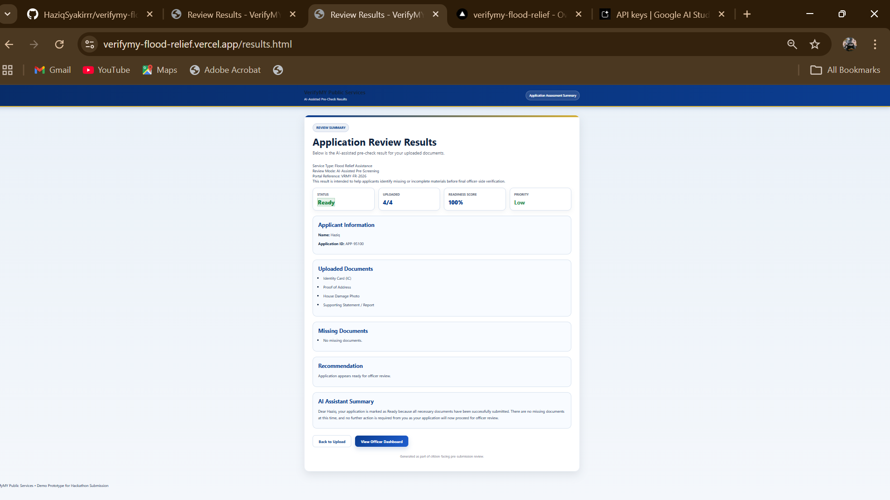
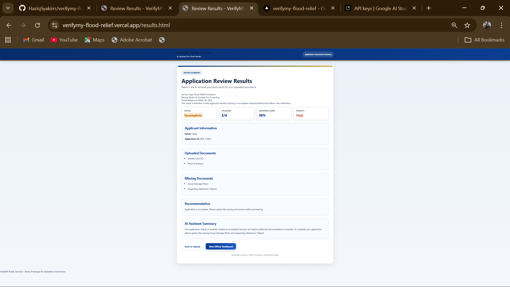
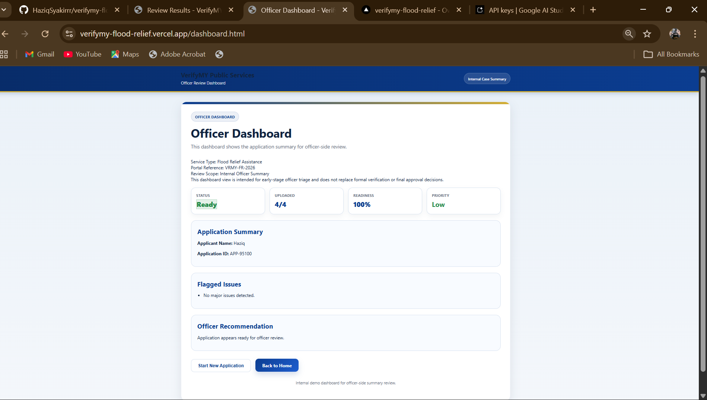
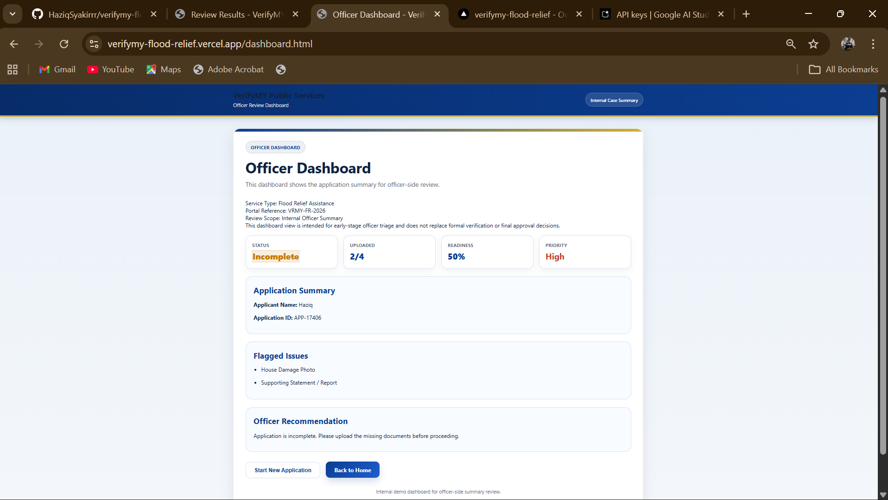

# VerifyMY

## Overview
VerifyMY is an AI-assisted GovTech prototype for flood relief document readiness screening. It helps citizens check whether their supporting documents are complete before submission, while also helping officers review applications more efficiently through a structured dashboard summary.

## Problem Statement
Flood relief applications are often delayed because applicants submit incomplete or unclear supporting documents. This increases manual verification work for officers, slows down the review process, and creates confusion for applicants who do not know what is missing.

## Solution
VerifyMY provides a simple digital workflow for early-stage document readiness checking. Citizens can review the required checklist, upload their files, and receive an AI-assisted summary explaining whether the application is ready or incomplete. Officers can then view a clean dashboard summary showing readiness, priority, and flagged issues.

## Key Features
- Flood relief application checklist
- Citizen-facing document upload portal
- Validation for missing applicant name
- Validation for incomplete document submission
- Readiness score calculation
- Priority level assignment
- Missing document detection
- AI Assistant Summary powered by Google Gemini
- Applicant-friendly explanation for Ready or Incomplete status
- Officer-side dashboard summary
- Start new application reset flow

## System Workflow
1. The applicant starts from the landing page.
2. The system displays the required flood relief documents.
3. The applicant enters a name and uploads the available files.
4. The system checks which required documents are submitted.
5. A readiness score is calculated based on document completeness.
6. A priority level is assigned based on the application status.
7. Google Gemini generates an AI Assistant Summary for the applicant.
8. The officer dashboard displays the same application summary for internal review.

## Readiness and Priority Logic
- **Readiness** represents how complete the application is.
- **Priority** represents how much review attention the case needs.

### Example
- 4/4 uploaded = 100% readiness = Low priority
- 3/4 uploaded = 75% readiness = Medium priority
- 2/4 uploaded = 50% readiness = High priority
- 1/4 uploaded = 25% readiness = High priority

## Tech Stack
- HTML
- CSS
- JavaScript
- localStorage
- Vercel
- Vercel Functions
- Google Gemini API

## Project Pages
- `index.html` – Landing page
- `checklist.html` – Required documents page
- `upload.html` – Citizen upload portal
- `results.html` – AI-assisted results page
- `dashboard.html` – Officer dashboard
- `api/gemini.js` – Server-side Gemini integration

## Live Demo
[Open VerifyMY Live Demo](https://verifymy-flood-relief.vercel.app)

## Sample Demo Files
The `assets` folder contains sample files for testing:
- `fake-ic.jpg`
- `utility-bill.png`
- `flood-damage.jpg`
- `support-letter.jpg`

## Screenshots

### Home Page

### Checklist Page

### Upload Page – Complete Case

### Upload Page – Incomplete Case

### Results Page – Complete Case with AI Summary

### Results Page – Incomplete Case with AI Summary

### Officer Dashboard – Complete Case

### Officer Dashboard – Incomplete Case

## How to Run Locally
1. Download or clone the repository.
2. Open the project in Visual Studio Code.
3. Open `index.html` in a browser.
4. Follow the workflow from the landing page to the results page and officer dashboard.
5. For the Gemini AI Assistant Summary, use the deployed Vercel version because the AI integration runs through a server-side API route.

## Prototype Note
This project is a prototype built for hackathon demonstration purposes. It focuses on pre-submission document readiness screening and does not replace formal officer-side verification or final approval.

## Future Enhancements
- OCR-based document content checking
- File type and clarity validation
- Applicant category prioritisation
- Officer comment and approval tools
- Multilingual support for BM and English